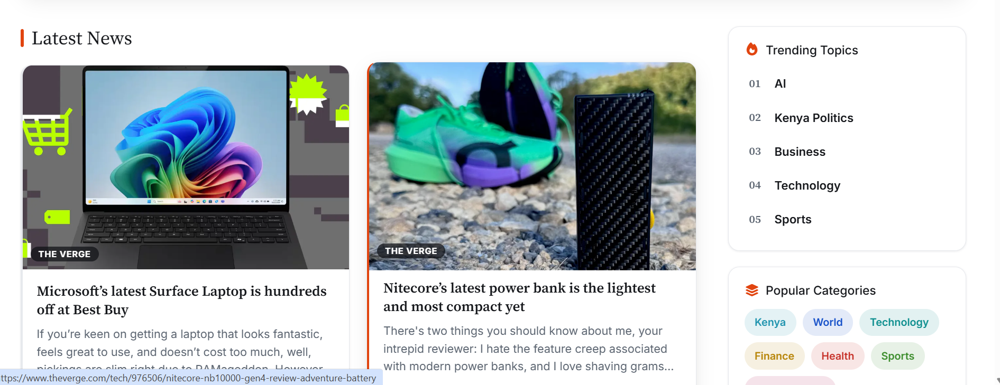
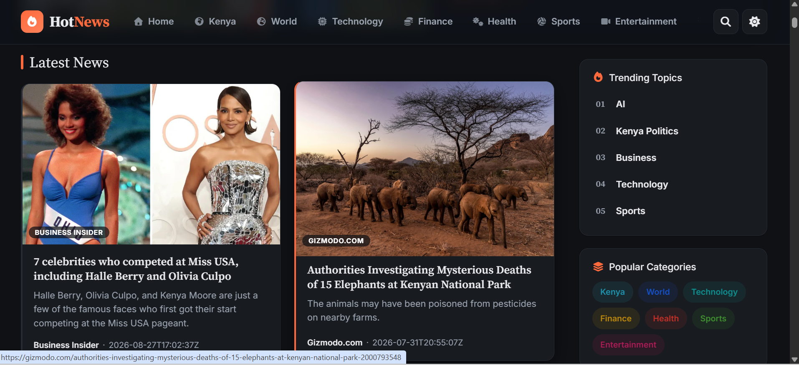
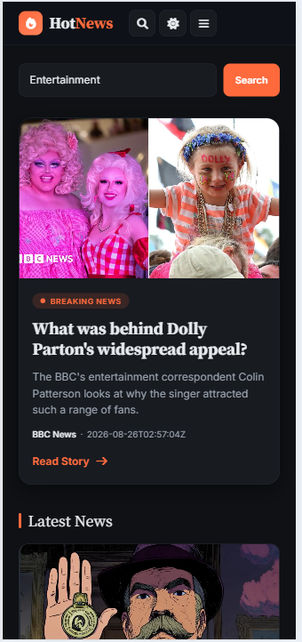

# 🔥 Hot News - Flask News Website

## 🌐 Live Demo

🚀 **Visit the live website:**  
👉 [https://mauricekabubs.pythonanywhere.com/](https://mauricekabubs.pythonanywhere.com/)

---

## 📖 Overview

**Hot News** is a dynamic news website built using **Python, Flask, HTML, CSS, and Bootstrap**. It fetches real-time news articles from the **News API** and displays them in a clean, modern, and responsive interface.

The project was built as a practical way to strengthen my skills in **backend development, API integration, responsive web design, deployment, and analytics**.

---

## ✨ Features

- 📰 Fetches latest news articles from News API
- 🔎 Search functionality for finding news by keyword
- 🗂️ Category filters including:
  - Kenya
  - World
  - Technology
  - Finance
  - Health
  - Sports
  - Entertainment
- 📱 Fully responsive design for desktop, tablet, and mobile
- 🌙 Dark mode
- 📊 Real-time analytics tracking using Google Analytics
- 🔥 Trending topics section
- 🎨 Clean and modern user interface
- 🚀 Deployed online using PythonAnywhere

---

## 🖼️ Screenshots

### 🖥️ Desktop - Home Page


### 📰 Desktop - Latest News



### 🌙 Dark Mode



### 📱 Mobile - Entertainment



### 📱 Mobile - Technology


---

## 🛠️ Tech Stack

| Technology | Purpose |
|------------|---------|
| 🐍 Python | Backend programming |
| 🌶️ Flask | Web framework |
| 🌐 HTML | Page structure |
| 🎨 CSS | Styling |
| 🅱️ Bootstrap | Responsive UI |
| 📰 News API | News data |
| 📊 Google Analytics | Website analytics |
| ☁️ PythonAnywhere | Deployment |

---

## 🎯 Goal of the Project

The main goals of this project were:

1. Build a **fully functional web application using Flask**
2. Integrate a **third-party REST API**
3. Handle and display dynamic data
4. Implement **search and category filtering**
5. Create a responsive interface using **Bootstrap**
6. Deploy a Flask application online
7. Track real user interactions using **Google Analytics**
8. Practice proper project structure and environment configuration

---

## 🧠 What I Learned

During the development of Hot News, I learned how to:

- Set up a Flask web application
- Create routes and render templates
- Work with Jinja2 templates
- Consume external REST APIs
- Process JSON responses from APIs
- Implement search functionality
- Implement category-based filtering
- Build responsive layouts using Bootstrap
- Implement dark mode
- Deploy Flask applications using PythonAnywhere
- Integrate Google Analytics
- Protect API credentials using `.env` files
- Organize a Flask project using a clean structure

---

## 🚀 Future Improvements

Some features I plan to add in the future:

- [ ] Pagination for news articles
- [ ] Dedicated category pages
- [ ] API response caching
- [ ] User authentication
- [ ] Save/favorite articles
- [ ] User comments
- [ ] Personalized news feeds
- [ ] Better recommendation system
- [ ] More advanced search and filtering

---

## 📂 Project Structure

```text
Hot-News/
│
├── screenshots/
│   ├── desktop-home.png
│   ├── desktop-news.png
│   ├── dark-mode.png
│   ├── mobile-entertainment.png
│   └── mobile-technology.png
│
├── static/
│   ├── css/
│   ├── js/
│   └── images/
│
├── templates/
│   ├── base.html
│   ├── index.html
│   ├── search.html
│   └── ...
│
├── app.py
├── requirements.txt
├── .env.example
├── .gitignore
└── README.md
